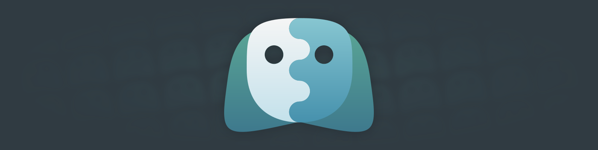
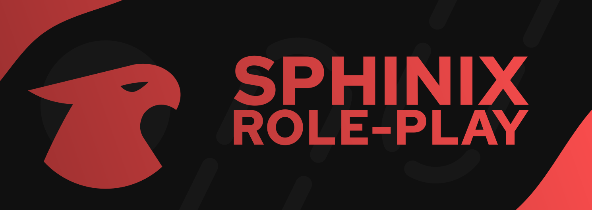

# Sphinix

>    
Основной логотип Sphinix. Он используется как временный логотип в официальных ресурсах проектов, а так же как логотип головной компании. 
[Скачать PNG](https://branding.sphinix.ru/Sphinix/Sphinix.png "Ссылка на скачивание PNG")
[Скачать SVG](https://branding.sphinix.ru/Sphinix/Sphinix.svg "Ссылка на скачивание SVG")

>    
Версия основного логотипа Sphinix без заднего фона. Он используется при наложении его на другие изображения и в тех местах, где версия с фоном смотрится не красиво. 
[Скачать PNG](https://branding.sphinix.ru/Sphinix\Sphinix_transparent.png "Ссылка на скачивание PNG")

>    
Баннер с использованием основного логотипа Sphinix. Он используется как временный баннер в официальных ресурсах проектов, а так же как баннер головной компании. 
[Скачать PNG](https://branding.sphinix.ru/Sphinix/Sphinix_banner.png "Ссылка на скачивание PNG")
[Скачать SVG](https://branding.sphinix.ru/Sphinix/Sphinix_banner.svg "Ссылка на скачивание SVG")

  

# SphinixDev

>    
Основной логотип SphinixDev. Им пользуется команда разработчиков Sphinix. 
[Скачать PNG](https://branding.sphinix.ru/SphinixDev/SphinixDev.png "Ссылка на скачивание PNG")
[Скачать SVG](https://branding.sphinix.ru/SphinixDev/SphinixDev.svg "Ссылка на скачивание SVG")

>    
Версия основного логотипа SphinixDev без заднего фона. Он используется при наложении его на другие изображения и в тех местах, где версия с фоном смотрится не красиво. 
[Скачать PNG](https://branding.sphinix.ru/SphinixDev/SphinixDev_transparent.png "Ссылка на скачивание PNG")

  

# SphinixServers

>    
Основной логотип SphinixServers. 
[Скачать PNG](https://branding.sphinix.ru/SphinixServers/Profile%20Pics/PFPServers.png "Ссылка на скачивание PNG")
[Скачать SVG](https://branding.sphinix.ru/SphinixServers/Profile%20Pics/PFPServers.svg "Ссылка на скачивание SVG")

>    
Версия основного логотипа Sphinix без заднего фона. Он используется при наложении его на другие изображения и в тех местах, где версия с фоном смотрится не красиво. 
[Скачать PNG](https://branding.sphinix.ru/SphinixServers/Websiteicons/IconServers.png "Ссылка на скачивание PNG")
[Скачать SVG](https://branding.sphinix.ru/SphinixServers/Websiteicons/IconServers.svg "Ссылка на скачивание SVG")

>    
Баннер с использованием основного логотипа SphinixServers. 
[Скачать PNG](https://branding.sphinix.ru/SphinixServers/Banners/BannerServers.png "Ссылка на скачивание PNG")
[Скачать SVG](https://branding.sphinix.ru/SphinixServers/Banners/BannerServers.svg "Ссылка на скачивание SVG")

 

## SphinixServers RolePlay

>    
Основной логотип SphinixServers RolePlay. 
[Скачать PNG](https://branding.sphinix.ru/SphinixServers/Profile%20Pics/PFPRoleplay.png "Ссылка на скачивание PNG")
[Скачать SVG](https://branding.sphinix.ru/SphinixServers/Profile%20Pics/PFPRoleplay.svg "Ссылка на скачивание SVG")

>    
Версия основного логотипа SphinixServers RolePlay без заднего фона. Он используется при наложении его на другие изображения и в тех местах, где версия с фоном смотрится не красиво. 
[Скачать PNG](https://branding.sphinix.ru/SphinixServers/Websiteicons/IconRoleplay.png "Ссылка на скачивание PNG")
[Скачать SVG](https://branding.sphinix.ru/SphinixServers/Websiteicons/IconRoleplay.svg "Ссылка на скачивание SVG")

>    
Баннер с использованием основного логотипа SphinixServers RolePlay. 
[Скачать PNG](https://branding.sphinix.ru/SphinixServers/Banners/BannerRolePlay.png "Ссылка на скачивание PNG")
[Скачать SVG](https://branding.sphinix.ru/SphinixServers/Banners/BannerRolePlay.svg "Ссылка на скачивание SVG")

## SphinixServers Event's
## SphinixServers SkyBlock

# SphinixServices
Тут пока ничего нет.
